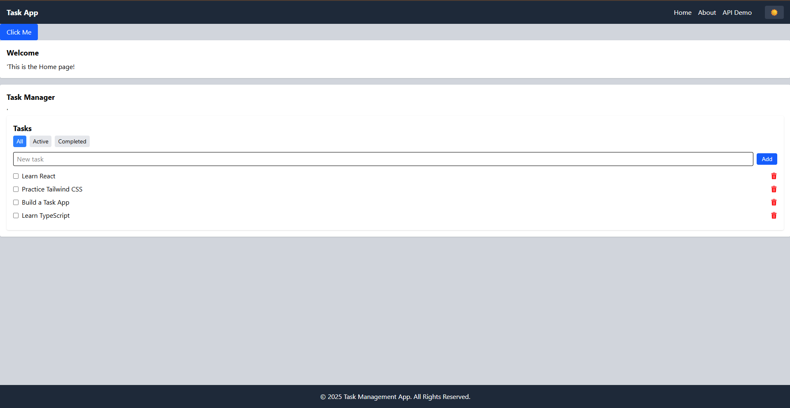

# Week 3 React.js Assignment – Task App

## 🚀 Live Demo
[View the deployed app on Vercel](https://week-3-react-js-assignment-brian-ma.vercel.app/)

## 📸 Screenshot


## 📂 Project Structure
- **Components:** Reusable UI elements (Button, Card, Navbar, Footer, TaskManager)
- **Pages:** Main route components (Home, About, API Demo)
- **Context:** Theme management (light/dark mode)
- **Hooks:** Custom hooks (useLocalStorage)

## ✨ Features
- Responsive React app built with Vite and Tailwind CSS
- Light/dark mode theme switcher (context + Tailwind dark mode)
- Task manager: add, complete, delete, filter tasks (with localStorage persistence)
- API integration: fetch, search, and paginate posts from JSONPlaceholder
- Clean, modular code with React Router
- Custom animation and transitions for interactive elements

## 🛠️ Setup Instructions
1. **Clone the repo:**
   ```sh
   git clone https://github.com/Brian-Masheti/week-3-react-js-assignment-Brian-Masheti.git
   cd week-3-react-js-assignment-Brian-Masheti/task-app
   ```
2. **Install dependencies:**
   ```sh
   npm install
   ```
3. **Run the development server:**
   ```sh
   npm run dev
   ```
4. **Open in your browser:**
   Visit [http://localhost:5173](http://localhost:5173)

## 📦 Build for Production
```sh
npm run build
```
The output will be in the `dist/` folder.

## 📝 Assignment Requirements Checklist
- [x] Vite + React + Tailwind CSS setup
- [x] Component architecture (Button, Card, Navbar, Footer, Layout)
- [x] State management with hooks and context
- [x] Custom hook for localStorage
- [x] API integration (fetch, search, pagination)
- [x] Responsive design and dark mode
- [x] Screenshots and deployment URL in README

## 👤 Author
Brian Masheti

---

> This project was completed as part of the PLP MERN Stack Development program, Week 3 assignment.
